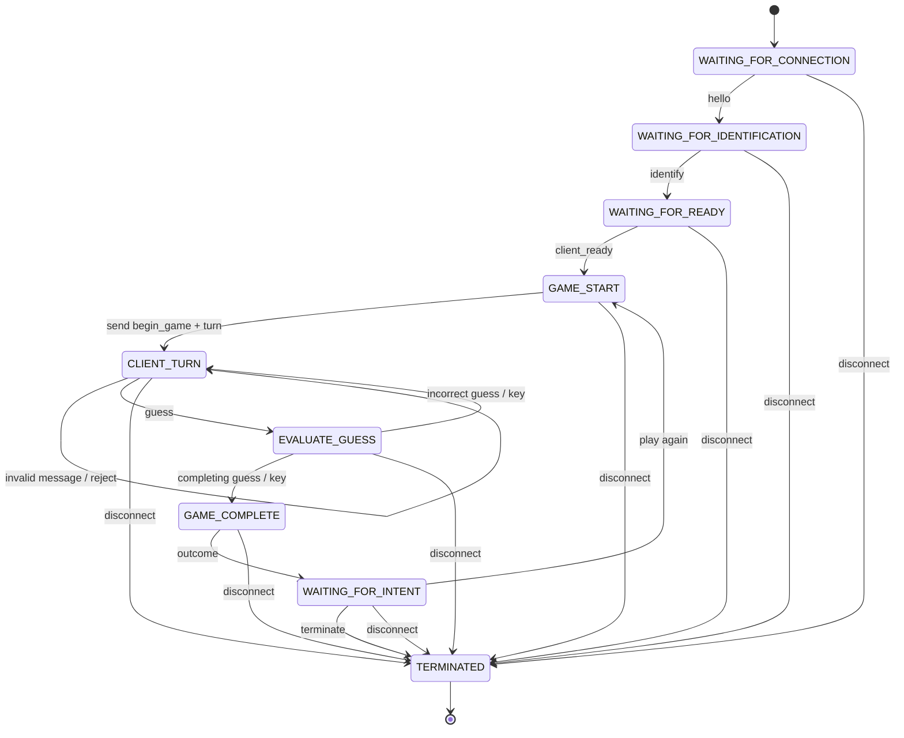

# Game Finite State Machine Specification

## 1. FSM Overview

The game is controlled by a server-side finite state machine (FSM).

The server maintains the current game state and changes states in response to valid client messages or game events.

The primary states are:

- `WAITING_FOR_CONNECTION`
- `WAITING_FOR_IDENTIFICATION`
- `WAITING_FOR_READY`
- `GAME_START`
- `CLIENT_TURN`
- `EVALUATE_GUESS`
- `GAME_COMPLETE`
- `WAITING_FOR_INTENT`
- `TERMINATED`

The FSM ensures that messages are processed according to the current state of the game.

## 2. Server States

### `WAITING_FOR_CONNECTION`

The server is waiting for a client to establish communication.

Transition:
- Receive `hello` → `WAITING_FOR_IDENTIFICATION`

### `WAITING_FOR_IDENTIFICATION`

The server has acknowledged the connection and is waiting for the client to identify the player and selected game.

Transition:
- Receive valid `identify` → `WAITING_FOR_READY`

### `WAITING_FOR_READY`

The server is waiting for the client/player to indicate that it is ready.

Transition:
- Receive valid `client_ready` → `GAME_START`

### `GAME_START`

The server begins the game and sends the `begin_game` message containing the correct code pattern.

Transition:
- After sending `begin_game` → `CLIENT_TURN`

### `CLIENT_TURN`

The server is waiting for the client to submit a guess.

Transition:
- Receive `guess` → `EVALUATE_GUESS`

### `EVALUATE_GUESS`

The server evaluates the client's guess and sends a `key` message containing the evaluation result.

Transitions:
- Guess is incorrect → `CLIENT_TURN`
- Guess completes the game → `GAME_COMPLETE`

### `GAME_COMPLETE`

The server sends an `outcome` message indicating the result of the game.

Transition:
- After sending `outcome` → `WAITING_FOR_INTENT`

### `WAITING_FOR_INTENT`

The server waits for the client to indicate whether it wants to play again or terminate.

Transitions:
- Receive `intent` indicating play again → `GAME_START`
- Receive `intent` indicating termination → `TERMINATED`
- Receive `disconnect` → `TERMINATED`

### `TERMINATED`

The game/session has ended and the connection may be closed.

No further game messages are processed after termination.

## 3. State Transitions

| Current State | Event / Message | Action | Next State |
|---|---|---|---|
| `WAITING_FOR_CONNECTION` | `hello` | Send `connection_ack` | `WAITING_FOR_IDENTIFICATION` |
| `WAITING_FOR_IDENTIFICATION` | `identify` | Record player and game | `WAITING_FOR_READY` |
| `WAITING_FOR_READY` | `client_ready` | Confirm readiness | `GAME_START` |
| `GAME_START` | Begin game | Send `begin_game` and `turn` | `CLIENT_TURN` |
| `CLIENT_TURN` | `guess` | Evaluate guess | `EVALUATE_GUESS` |
| `EVALUATE_GUESS` | Incorrect guess | Send `key` | `CLIENT_TURN` |
| `EVALUATE_GUESS` | Correct/completing guess | Send `key` | `GAME_COMPLETE` |
| `GAME_COMPLETE` | Game complete | Send `outcome` | `WAITING_FOR_INTENT` |
| `WAITING_FOR_INTENT` | Play again | Start new game | `GAME_START` |
| `WAITING_FOR_INTENT` | Terminate | End session | `TERMINATED` |
| Any active state | `disconnect` | End session | `TERMINATED` |

## 4. Player Roles and Turn Management

The server is responsible for maintaining the game state and controlling the progression of the game.

The client is responsible for:

- Identifying the player and selected game
- Indicating readiness
- Submitting guesses
- Indicating whether to play again or terminate

The server controls turn progression by sending the `turn` message to indicate that the client may submit a guess.

The client may submit a `guess` only when the game is in the `CLIENT_TURN` state.

After receiving and evaluating a guess, the server sends a `key` message containing the evaluation result.

If the guess is incorrect, the server returns to `CLIENT_TURN`.

If the guess completes the game, the server proceeds to `GAME_COMPLETE`.

## 5. Invalid Moves and Error Handling

A message is invalid when it is received while the server is in a state where that message is not expected.

Examples include:

- Receiving `guess` before the client has been given a turn
- Receiving `client_ready` before identification
- Receiving `identify` after the game has already begun
- Receiving game messages after termination

Invalid messages do not advance the FSM to a new game state.

The server should reject or ignore invalid messages rather than treating them as valid state transitions.

## 6. Connection and Disconnection Transitions

A client begins the protocol by sending `hello` to the server.

The server responds with `connection_ack`.

The client may intentionally terminate the session by sending a `disconnect` message.

A `disconnect` message causes the server to transition to `TERMINATED` regardless of the current active game state.

After termination, the server closes or otherwise ends the application-level session.

## 7. Game Completion and Reset

When the server determines that the game is complete, it sends an `outcome` message to the client.

The server then waits for the client's `intent`.

If the client chooses to play again, the server begins a new game and returns to `GAME_START`.

If the client chooses to terminate, the server transitions to `TERMINATED`.

A new game resets the game-specific state while maintaining the established client-server session.

## 8. Mermaid State Diagram

